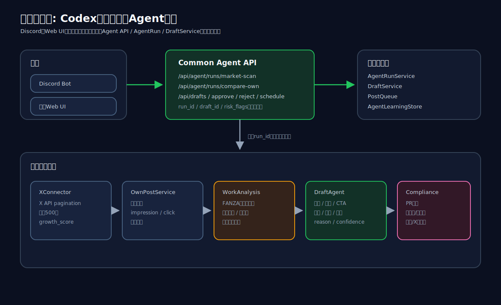
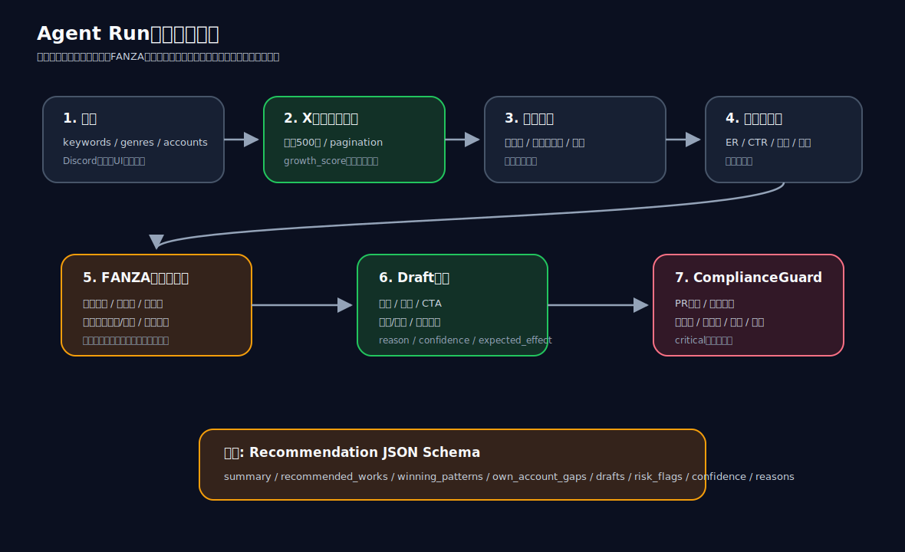
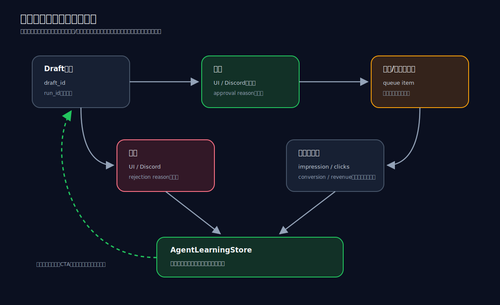

# Codex Agent 実装説明書

このドキュメントは、現在のFANZAアフィリエイト運用支援システムが「何をしているか」「どこを見ればよいか」「DiscordとWeb UIからどう使うか」を、運用者向けにまとめた説明書です。

## 1. 全体像



現在の実装では、Discordと既存Web UIが別々の分析ロジックを持たないようにしています。

どちらから実行しても、バックエンドの共通APIを通り、同じ `run_id`、同じ `draft_id`、同じ `risk_flags` を参照します。

主な入口は以下です。

- Discord: `/market_scan`, `/compare_own`, `/draft`, `/approve`, `/reject`, `/report`
- Web UI: `Agent Ops` タブ内の `Market Scan / Own Benchmark / Draft Lab / Approval / Agent Run Logs`
- API: `/api/agent/runs/*`, `/api/drafts/*`, `/api/reports/daily`

## 2. 何を改善したのか

以前の問題は、単にClaudeの回答品質だけではなく、運用の構造にありました。

- 分析入力が浅い
- 自分の投稿実績との比較が弱い
- 作品選定と投稿文生成が分断されている
- 画像/動画まで改善対象になっていない
- 投稿後の成果が次回提案に戻っていない
- UIとDiscordの操作体験が別々
- 提案理由が説明しにくい

今回の実装では、以下を1つのAgent Runにまとめています。

- X市場投稿の収集
- 競合投稿の勝ち型分類
- 自分の投稿実績との比較
- FANZA作品候補のスコアリング
- 投稿文、CTA、画像/動画、投稿時間の提案
- ComplianceGuardによる安全確認
- 承認/却下/投稿結果の学習データ保存

## 3. Agent Runの流れ



Agent Runは、おおまかに次の順で動きます。

1. UIまたはDiscordから実行する
2. X APIで市場投稿を最大500件取得する
3. `growth_score` で伸びている投稿をランキングする
4. 投稿を勝ち型に分類する
5. 自分の過去投稿と比較する
6. FANZA作品候補をスコアリングする
7. 複数のdraft案を生成する
8. ComplianceGuardでPR表記、成人向け、安全性、権利、重複を確認する
9. `recommendationSchema` としてJSONで保存する

## 4. 競合投稿の分類

競合投稿は、以下の型に分類されます。

- 作品名訴求
- 女優名訴求
- ジャンル訴求
- セール訴求
- ランキング訴求
- 画像メイン
- 動画メイン
- 短文CTA
- 長文レビュー
- スレッド型
- プロフィール誘導型

この分類結果から、`winningPatterns` を作ります。

例:

```json
{
  "pattern": "sale_appeal",
  "label": "セール訴求",
  "avgGrowthScore": 142.3,
  "reason": "セール訴求が8件、平均growth_score=142.3"
}
```

## 5. 自分の投稿との差分

自分の投稿は、以下の軸で比較されます。

- 投稿時間
- 投稿文の長さ
- 画像/動画/リンクの有無
- ジャンル
- 訴求軸
- engagement rate
- URLクリック率
- conversions / revenue 用の構造

現在は `/api/analytics/revenue-report/import` からDMM/FANZA成果レポート行を取り込み、`post_id`、`product_id`、`content_id` 単位で `conversions` と `revenue` を自分の投稿比較へ戻せます。

差分は `ownAccountGaps` として出ます。

例:

```json
{
  "code": "unused_winning_pattern",
  "axis": "pattern",
  "message": "競合ではセール訴求が伸びていますが、自分の直近投稿ではほぼ使えていません",
  "recommended_action": "セール訴求を1作品2案のうち最低1案に採用する"
}
```

## 6. FANZA作品スコアリング

作品候補は、既存のFANZA/DMM取得ロジックを使い、次の情報でスコアリングします。

- X市場反応との一致
- ジャンル
- セール/価格
- 発売日
- レビュー数と評価
- ランキング系の強さ
- サンプル画像/動画の有無
- 過去クリック実績との相性
- 公式素材または権利確認済み素材があるか

出力は `recommendedWorks` に入ります。

## 7. Draft生成

Draftは投稿文だけではありません。

1つのdraftには、以下が入ります。

- 投稿対象作品
- 投稿文
- CTA
- ハッシュタグ
- 添付画像/動画の形式
- 投稿時間
- 避けるべき投稿パターン
- reason
- confidence
- expected_effect
- risk_flags

例:

```json
{
  "draft_text": "PR・広告｜...",
  "cta": "詳細はリプ欄で確認してください",
  "media_format": "image",
  "recommended_post_time_jst": "20:00",
  "reason": "セール訴求が市場で強い。作品スコア6.2...",
  "confidence": 0.78,
  "expected_effect": "価格理由を明確にしてクリック前の期待値を揃える",
  "risk_flags": []
}
```

## 8. 承認付き運用と学習ループ



完全自動投稿はしません。

Draftは必ず人間が承認、却下、または予約します。

承認・却下・投稿後結果は、次回提案に戻ります。

- 承認されたdraft
- 却下されたdraft
- 却下理由
- 投稿済み結果
- クリック実績
- 失敗理由

これらは `AgentLearningStore` に保存されます。

## 9. Discordでできること

| コマンド | 役割 |
|---|---|
| `/market_scan` | X市場スキャンを実行 |
| `/compare_own` | 市場と自分の投稿を比較 |
| `/draft` | 改善提案draftを生成 |
| `/approve` | draftまたはqueue itemを承認 |
| `/reject` | draftまたはqueue itemを却下 |
| `/report` | Agent Runの要約を表示 |

Discordでは長文の分析全文は出しません。

表示するのは、run_id、スコア、勝ち型、推奨作品、改善提案、risk_flagsの要約です。

詳細はWeb UIまたはAPIの `run_id` で確認します。

## 10. Web UIでできること

現在のUIでは、`Agent Ops` タブ内で以下を画面別に確認できます。

- `Market Scan`: 伸びている投稿ランキング、growth_score、勝ち型
- `Own Benchmark`: 自分の投稿との差分、時間/媒体/文字数ギャップ
- `Draft Lab`: 推奨作品、投稿文、CTA、媒体、投稿時間、expected_effect
- `Approval`: Discordと共通の承認待ちdraft
- `Agent Run Logs`: run_id、status、data_count、実行サマリ
- `Compliance`: PR表記、成人向け、安全性、権利、重複リスク
- `Learning Loop`: 承認/却下/投稿後メトリクスの学習状態

また、UI上のdraft承認/却下ボタンは、Discordと同じ `/api/drafts/:id/*` を呼びます。

## 11. 共通API

現在の主なAPIは以下です。

| API | 役割 |
|---|---|
| `POST /api/agent/runs/market-scan` | 市場スキャンを実行 |
| `POST /api/agent/runs/compare-own` | 自分の投稿と比較 |
| `POST /api/agent/runs/work-analysis` | 作品分析寄りのAgent Run |
| `POST /api/drafts` | draft生成 |
| `POST /api/drafts/:id/approve` | draft承認 |
| `POST /api/drafts/:id/reject` | draft却下 |
| `POST /api/drafts/:id/schedule` | draft予約 |
| `GET /api/agent/runs/:id` | Agent Run詳細 |
| `GET /api/agent/runs/:id/events` | Agent Runイベント |
| `GET /api/reports/daily` | 日次レポート |
| `POST /api/analytics/revenue-report/import` | DMM/FANZA成果レポート行の取り込み |
| `GET /api/analytics/revenue-report/signals` | CVR/revenue信号の確認 |
| `POST /api/analytics/agent-weights/refresh` | 投稿後メトリクスから重み更新 |
| `GET /api/analytics/agent-weights` | 現在の重み状態 |

既存UI互換のため、旧APIも一部残しています。

## 12. 重要なファイル

| ファイル | 役割 |
|---|---|
| `artifacts/api-server/src/bot/agent-service.ts` | Agent Run全体のオーケストレーション |
| `artifacts/api-server/src/bot/x-connector.ts` | X市場投稿の取得、pagination、growth_scoreランキング |
| `artifacts/api-server/src/bot/own-post-service.ts` | 自分の投稿実績、クリック、CVR/revenue信号の比較用整形 |
| `artifacts/api-server/src/bot/market-analysis-service.ts` | 競合投稿と自投稿の差分分析 |
| `artifacts/api-server/src/bot/work-analysis-service.ts` | FANZA/DMM作品候補の分析入口 |
| `artifacts/api-server/src/bot/draft-agent.ts` | 作品、投稿文、CTA、媒体、時間の提案生成 |
| `artifacts/api-server/src/bot/posting-improvement.ts` | 勝ち型分類、差分抽出、作品スコア、draft生成 |
| `artifacts/api-server/src/bot/draft-service.ts` | draft承認/却下/予約の共通サービス |
| `artifacts/api-server/src/bot/revenue-report-store.ts` | DMM/FANZA成果レポート保存とCVR/revenue集計 |
| `artifacts/api-server/src/bot/agent-weight-service.ts` | 勝ち型、CTA、作品スコア重みの更新 |
| `artifacts/api-server/src/bot/compliance-guard.ts` | PR表記、安全性、権利、重複チェック |
| `artifacts/api-server/src/bot/growth-score.ts` | 競合投稿ランキング |
| `artifacts/api-server/src/bot/agent-run-store.ts` | run_id保存 |
| `artifacts/api-server/src/bot/agent-learning-store.ts` | 承認/却下/投稿後学習 |
| `artifacts/api-server/src/routes/agent.ts` | 共通Agent API |
| `artifacts/api-server/src/bot/discord-bot.ts` | Discord操作 |
| `artifacts/bot-dashboard/src/App.tsx` | 既存Web UI表示 |

## 13. 安全ガードレール

成人向けアフィリエイトのため、以下は最優先で守ります。

- PR/広告/アフィリエイト表記を必ず入れる
- 未成年関連の性的表現をブロックする
- 非同意、強制、盗撮、薬物系をブロックする
- 権利確認できない画像/動画をブロックする
- 直近投稿と似すぎる文面を警告する
- Xのスパム、重複投稿、プラットフォーム操作を避ける
- critical riskがあるdraftは承認できない

## 14. Replitで動かすときの確認

最低限、以下の環境変数を確認してください。

- `PORT`
- `TWITTER_API_KEY`
- `TWITTER_API_SECRET`
- `TWITTER_ACCESS_TOKEN`
- `TWITTER_ACCESS_SECRET`
- `TWITTER_USER_ID` または `TWITTER_USERNAME`
- `DMM_API_ID`
- `DMM_AFFILIATE_ID`
- `DISCORD_BOT_TOKEN`
- `DISCORD_CHANNEL_ID`
- `DISCORD_GUILD_ID`
- `REBRANDLY_API_KEY` 任意
- `AI_INTEGRATIONS_ANTHROPIC_API_KEY` 任意
- `AI_INTEGRATIONS_ANTHROPIC_BASE_URL` 任意

Claude関連は残していますが、Agent改善フローは共通サービス側へ寄せています。

## 15. 次に残っている課題

次に強化するなら、以下が優先です。

1. DMM/FANZA成果レポートのCSVアップロードUIを追加する
2. 取り込んだrevenue信号とFANZA作品IDの突合精度を上げる
3. adaptive weightsを作品スコアとdraft confidenceへより強く反映する
4. Claude会議/生成フローの旧入口を順番にAnalysisAdapter呼び出しへ寄せる
5. Agent Run詳細画面でeventsストリームとエラー復旧導線を強化する
